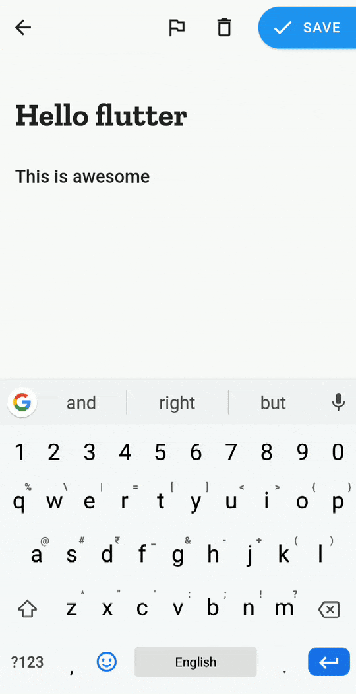
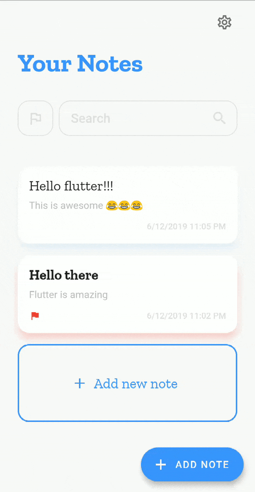

# Draft - Notes app

## Features

1. _Animated UI_: A beautiful, minimalist user interface with subtle animations.
2. _Dark mode_: Light and dark theme variants.
3. _Mark notes as important_: Mark notes as important and filter them.
4. _Search_: Search your notes.
5. _Edit note_: Edit note that you saved previously
6. _Share_: Share note using any app that can share text.

## Dependencies

- outline_material_icons: ^0.1.0
- sqflite: ^1.1.5
- intl: ^0.15.8
- url_launcher: ^5.0.3
- shared_preferences: ^0.5.3+1
- share: ^0.6.1+1

## Screenshots

